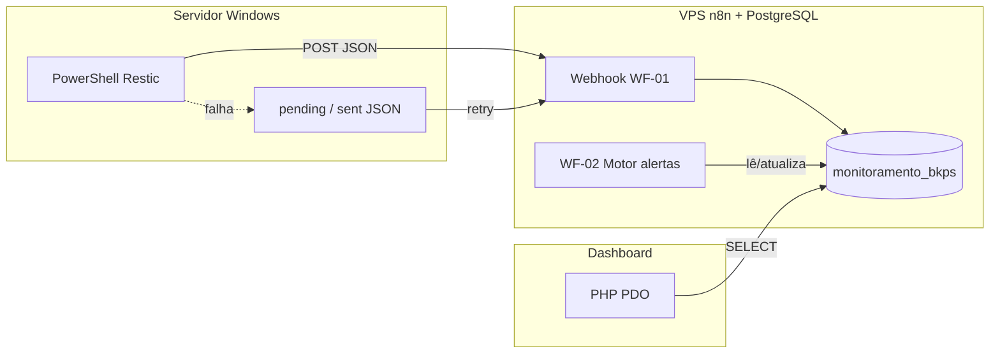

# Consolidação do projeto — monitoramento central de backups + NOC PHP

**Data:** 30/03/2026  
**Tipo:** documento de referência (planejamento + estado atual).  
**Fontes cruzadas:** código em `SistemaBackup`, relatórios enviados nos chats, exports JSON dos workflows n8n (`backup-monitor-ingest-v1`, `MONITORAMENTO BKP - MOTOR DE ALERTAS`).

---

## 1. Para que serve este documento

Registrar **o que já foi visto e validado** (ou explicitamente pendente) para:

- não perder o fio entre **coleta (PS1)**, **ingestão (n8n)**, **persistência (PostgreSQL)**, **motor de alertas (n8n)** e **observabilidade (dashboard PHP)**;
- separar **fato no repositório** de **fato só na VPS / scripts fora do Git**;
- listar **lacunas**, **riscos** e **próximos passos** sem misturar com suposições não marcadas.

Documentos anteriores no repo:

- `docs/step-by-step/step-by-step-2025-03-25.md` — MVP PHP inicial (lista incompleta de arquivos em relação ao estado atual; ver secção 8).
- `docs/step-by-step/step-by-step-2026-03-30-ambientes-git-e-deploy.md` — GitHub, servidor, Coolify (pendências), BD só na VPS.

---

## 2. Visão do produto (duas camadas)

| Camada | Papel | Situação |
|--------|--------|----------|
| **A — Técnica / NOC** | Eventos, histórico, recorrência, assinatura de causa, incidente, severidade, timeline | Em construção; PHP MVP + n8n ingest + motor de alertas descritos abaixo |
| **B — Executiva / cliente** | Totais por status, último sucesso, aging, cota, PDF/e-mail, substituição ao relatório legado tipo MSP | **Roadmap**; derivar por agregação a partir da base A |

Objetivo estratégico: **não copiar** o relatório legado; **gerar** visão executiva a partir da base rica (evento + estado + alertas).

---

## 3. Arquitetura lógica (confirmada pelo desenho acordado + workflows)

- **WF-01** (`backup-monitor-ingest-v1`): ingestão e normalização; **não** decide incidente (só estado e histórico).
- **WF-02** (`MONITORAMENTO BKP - MOTOR DE ALERTAS`): decisão **OPEN / RESOLVE / NOOP** e escrita em `backup_alert_events` + flags de incidente no estado.

---

## 4. PostgreSQL — database `monitoramento_bkps`

Confirmado nos **relatórios consolidados** e nas **queries dos JSON** do n8n (nomes de tabelas/colunas batem com o uso no workflow).

### 4.1 `backup_job_catalog`

Metadados do job (empresa, servidor, nome, repositório, janela, políticas, `chatwoot_inbox_id`, etc.).

### 4.2 `backup_job_state`

Estado atual por job: última execução, status reportado vs efetivo, snapshot, duração, contadores, `last_warning_signature`, `missed_count`, incidente (`is_incident_open`, `incident_severity`).

**Semântica (relatórios):**

- `last_status_reportado`: valores do agente, p.ex. `SUCCESS`, `WARNING`, `ERROR`.
- `last_status_efetivo`: valores para NOC, p.ex. `OK`, `WARNING`, `ERROR`, e reservados `LATE`, `MISSED`, `DEGRADED` (nem todos precisam estar implementados no ingest).

**Mapeamento ingest (nó Code no WF-01, evidência no JSON):** `status === 'SUCCESS'` → `last_status_efetivo = 'OK'`; `WARNING`/`ERROR` preservados.

### 4.3 `backup_execution_events`

Histórico técnico por execução; `event_uid` único; colunas alinhadas ao JSON do PS1 + `warning_signature`, `raw_payload_json`, `received_at`, etc. (lista completa nas queries `INSERT`/`SELECT` do export WF-01/WF-02).

### 4.4 `backup_alert_events`

Histórico formal de alertas; `dedup_key` único; ligação opcional a `execution_event_id`.

**Segurança:** credenciais PostgreSQL **não** devem constar em Git nem neste arquivo; usar `config/database.local.php` / variáveis de ambiente.

---

## 5. Workflow WF-01 — `backup-monitor-ingest-v1` (export analisado)

**Entrada:** POST webhook, path `backup-monitor`.

**Fluxo resumido:**

1. Validar presença de `empresa`, `servidor`, `job`.
2. Buscar `id` no catálogo (ativo).
3. Merge payload + job → `INSERT` em `backup_execution_events` com `ON CONFLICT (event_uid) DO NOTHING RETURNING id`.
4. Calcular `last_status_efetivo` (SUCCESS → OK).
5. `UPDATE backup_job_state` (inclui contadores consecutivos, assinatura de warning por prioridade, `missed_count = 0`).
6. Resposta HTTP 200/400 conforme ramo.

**Observações técnicas registradas na análise do JSON (para não esquecer):**

- Possível **ligação paralela** do nó de validação ao **Merge** e ao **IF** — validar em execução se não gera comportamento indesejado com payload inválido.
- **Reenvio com mesmo `event_uid`:** com `DO NOTHING`, é preciso confirmar se a cadeia seguinte trata **zero linhas** retornadas pelo INSERT.
- Várias queries interpolam strings **sem** escape uniforme → risco de quebra de SQL / injeção se campos vierem com `'` ou conteúdo inesperado.
- Nós **não ligados** no export analisado: `Respond - Job Found`, `Postgres -teste` — tratá-los como debug ou remover em limpeza.

---

## 6. Workflow WF-02 — `MONITORAMENTO BKP - MOTOR DE ALERTAS` (export analisado)

**Gatilho:** Schedule (intervalo em minutos — valor numérico **não** apareceu no trecho exportado; confirmar na UI n8n).

**Fluxo resumido:**

1. Listar jobs ativos com `last_execution_id IS NOT NULL`.
2. Por job: carregar último evento (`JOIN` em `backup_execution_events` via `last_execution_id`).
3. Code: decisão **OPEN** (WARNING recorrente com `warning_policy = track` e `consecutive_warning_count >= 2`, ou ERROR com incidente fechado), **RESOLVE** (incidente aberto e `last_status_efetivo = OK`), senão **NOOP**.
4. OPEN: atualiza incidente no state + `INSERT` alerta `ON CONFLICT (dedup_key) DO NOTHING`.
5. RESOLVE: fecha incidente + `UPDATE backup_alert_events SET resolved_at = NOW()` para **todos** os alertas abertos daquele `job_catalog_id`.

**Pontos a manter em mente:**

- Em abertura por **ERROR**, o SQL visto mantém `last_warning_signature` anterior quando não é ramo WARNING — confirmar se é regra de produto desejada.
- **RESOLVE** em massa por job: confirmar se é intenção fechar vários alertas de uma vez.

**Nó solto no export:** `Execute a SQL query` com `job_catalog_id = 2` fixo — apenas teste.

---

## 7. Scripts PowerShell (referência Piloto / padrão DNT)

**Fora deste repositório Git** (salvo futura pasta `scripts/`).

**Comportamento acordado:**

- Restic backup + forget/prune; parse de log; classificação `SUCCESS` / `WARNING` / `ERROR`.
- JSON com `event_uid`, `schema_version`, métricas de ficheiros/dirs, `added_to_repo`, `stored_data`, envio ao webhook n8n, fila `pending`/`sent`, retry.

**Lacunas conhecidas para evolução (não supor já resolvido):**

- `backup_paths` **não** estavam no JSON do modelo Piloto (só no log texto).
- Caminhos de ficheiros com falha: contadores existem; lista detalhada exigiria parse adicional do stderr/log.

---

## 8. Dashboard PHP — repositório `SistemaBackup`

### 8.1 Ficheiros relevantes (estado do repo)

| Área | Ficheiros |
|------|-----------|
| Entrada | `index.php`, `bootstrap.php` |
| Config | `config/database.php`, `config/database.local.example.php` |
| API | `api/index.php`, `api/.htaccess`, `src/ApiJobs.php` |
| Serviços | `src/Services/JobBoardService.php`, `JobDetailService.php` |
| UI | `templates/board.php`, `job_detail.php`, `partials/board_table_rows.php`, layouts |
| Deploy local opcional | `Dockerfile`, `docker/apache-site.conf` |

O ficheiro `step-by-step-2025-03-25.md` **não lista** `ApiJobs`, `api/*`, Docker — este documento supre essa lacuna.

### 8.2 Rotas (evidência `index.php` + `api/index.php`)

- `index.php` → board (default), `route=job&catalog_id=`, `route=api_board`.
- `GET /api/jobs/board` e `GET /api/jobs/{id}` via `api/index.php` (ou `?__path=`).

### 8.3 O que o PHP lê hoje vs riqueza no BD

- **Board / cabeçalho:** alinhado a `backup_job_catalog` + `backup_job_state` (como em `JobBoardService` / `fetchHeader`).
- **`backup_execution_events`:** `JobDetailService::fetchExecutions` seleciona **subconjunto** de colunas (status, snapshot, exit codes, locks, contagens de warning) — **não** expõe ainda `files_*`, `processed_*`, `added_to_repo`, `warning_signature`, `raw_payload_json`, etc., embora o WF-01 possa gravá-las.

**SLA em ecrã:** `src/helpers.php` — `sla_visual()` é **heurístico** por `last_status_efetivo`, não regra de negócio final acordada.

---

## 9. Jobs de referência (catálogo)

| Empresa | Servidor | Job | Notas |
|---------|----------|-----|--------|
| Piloto | MATRIZ | `backup_restic_piloto_matriz` | Execução real validada no fluxo central (relatórios) |
| DNT | PVE2 | `backup_restic_dnt_pve2` | Catálogo/state referidos; validação operacional final a fechar quando aplicável |

---

## 10. Relatório legado (contexto)

Exemplo analisado: relatório executivo tipo **MSP Cloud Storage** — agregados, última execução, último sucesso, alertas de desatualização/cota. Serve de **referência de UX executiva**, não de modelo de dados do novo sistema.

---

## 11. Pendências e riscos (checklist vivo)

| ID | Tema | Estado |
|----|------|--------|
| P1 | **MISSED** / aging fechado no n8n + estado | Pendente (mencionado nos relatórios) |
| P2 | Idempotência: reenvio de `event_uid` e contadores / UPDATE sem novo insert | A validar com comportamento real do WF-01 |
| P3 | Escaping / parametrização SQL nos n8n Postgres nodes | Melhorar |
| P4 | Limpar nós desligados nos workflows (teste/debug) | Higiene |
| P5 | DNT: confirmar primeira execução real no pipeline | Operacional |
| P6 | Dashboard: alargar SELECT/UI para métricas já persistidas | Produto + PHP |
| P7 | Contrato JSON formal versionado (PS1 ↔ n8n ↔ BD) | Documentação |
| P8 | Camada executiva + Chatwoot | Depois de NOC estável |

---

## 12. Direções acordadas (não regredir)

- Manter **ingestão = normalização + histórico + estado**; **alertas = decisão** em WF-02; **PHP = leitura / NOC**.
- Não introduzir tabela paralela de “alerta aberto” se o modelo atual com `is_incident_open` + `backup_alert_events` for mantido.
- Evitar reescrita desnecessária; evolução incremental.

---

## 13. Próximo passo sugerido (ordem)

1. Confirmar na prática os itens **P2** e **Merge/validação** do WF-01 (uma execução de teste documentada).
2. Fechar **P1 MISSED** ou documentar decisão de adiar.
3. Alargar dashboard (API + detalhe) para colunas já gravadas, usando **uma** estratégia: colunas dedicadas vs leitura de `raw_payload_json`.
4. Só depois: relatório executivo, e-mail, Chatwoot.

---

## 14. Alterar este documento

Ao mudar workflows, schema ou PHP, acrescentar uma linha no topo (histórico de revisões) ou criar novo `step-by-step-AAAA-MM-DD.md` com delta, para preservar rastreabilidade.

---

---

## Revisão 30/03/2026 (tarde)

- Dashboard PHP: detalhe do job com volumes da última execução (`processed_data`, `added_to_repo`, `stored_data`, `restic_duration`), resumo executivo (último SUCCESS, dias desde SUCCESS), tabela de execuções alargada, coluna de pastas via `backup_paths` no JSON quando existir, coluna de ficheiro/erro via `warning_signature` ou texto derivado das contagens.
- Board NOC: colunas `last_success_at`, dias sem SUCCESS, último processado/+repo; resumo por status efetivo.
- API `GET /api/jobs/{id}`: campo `last_success_execution`.
- Script de referência: `scripts/exemplo-extensao-payload-ps1.ps1` (como incluir `backup_paths` e `warning_signature` no PS1).
- **Limitação explícita na UI:** não há no BD o tamanho total acumulado do repositório remoto; só métricas por execução Restic até integrar outra fonte.

**Fim do documento de consolidação — 30/03/2026.**
